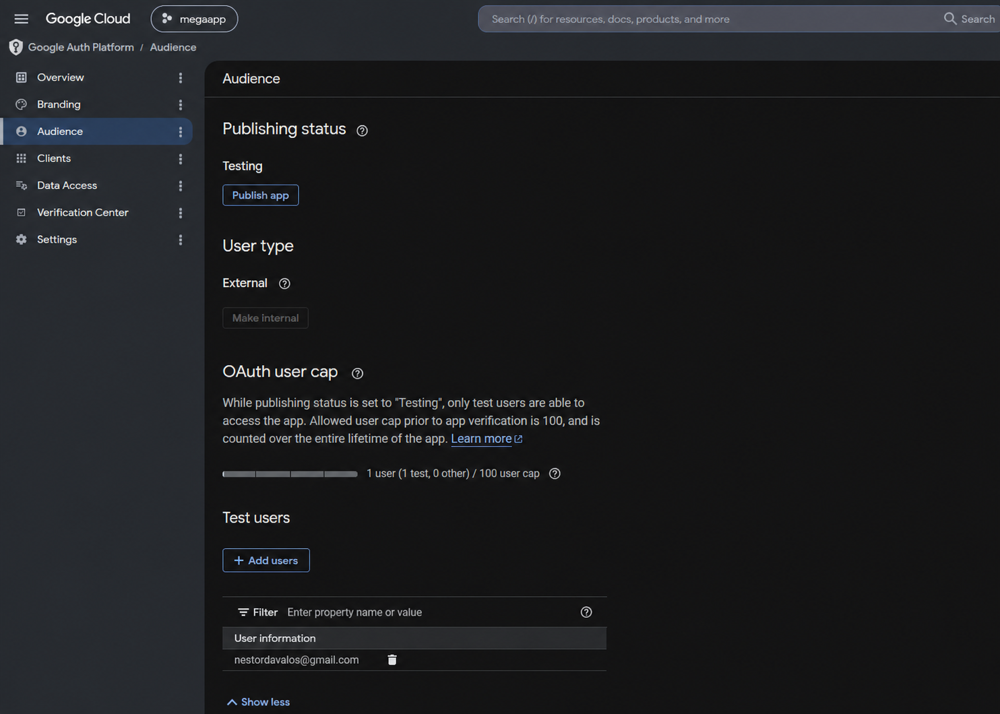

# Verificação da OAuth consent screen para MEGA

Guia de preparação e envio da verificação do MEGA no Google para usar Google Calendar com contas externas em produção.

## Escopo desta verificação

O MEGA solicita estes escopos para conectar o Google Calendar:

```text
openid
email
profile
https://www.googleapis.com/auth/calendar
```

O acesso completo ao Calendar é um escopo **sensível**. Um aplicativo externo publicado precisa de verificação de marca e de acesso aos dados antes que usuários em geral possam autorizá-lo. Ele não é um escopo restrito; uma avaliação anual de segurança é aplicável se escopos restritos forem adicionados ou seus dados forem acessados por um servidor de terceiros.

Em geral, a verificação não é necessária somente para desenvolvimento/testes, uso pessoal limitado ou aplicativo **Internal** usado exclusivamente pela mesma organização do Google Workspace. Para contas Gmail ou Workspace de clientes, use **External** e prepare a verificação.

### APIs necessárias e relação com OAuth

Em **APIs & Services > Library**, ative **Google Calendar API**: ela é a API necessária para esta verificação e para a sincronização do Calendar. A verificação OAuth não é concluída apenas ativando uma API; também é necessário declarar os escopos em **Data Access** e demonstrar seu uso.

Se a mesma instalação usar outras funções Google, ative **Cloud Storage API** para GCS. Não ative **Gmail API** apenas porque o MEGA usa Gmail via OAuth: a implementação atual usa IMAP/SMTP com XOAUTH2 e o escopo `https://mail.google.com/`, não endpoints REST do Gmail. Gmail API só será necessária se o MEGA adicionar chamadas REST do Gmail.

## Antes de começar

Use um projeto Google Cloud exclusivo para produção. Mantenha outro projeto e cliente OAuth para desenvolvimento ou staging. Reúna:

- Domínio HTTPS público próprio: `https://<seu-dominio>`.
- Página inicial pública que identifique o MEGA, explique a integração com Google Calendar e não seja apenas uma tela de login.
- Política de privacidade pública no mesmo domínio, também vinculada na página inicial.
- Termos de serviço públicos no mesmo domínio.
- E-mails de suporte e contato do desenvolvedor monitorados ativamente.
- Logo quadrado do MEGA que represente o aplicativo, em PNG/JPG/BMP, com no máximo 1 MB; recomenda-se 120 × 120 px.
- Conta Google que seja Owner ou Editor do projeto e proprietária verificada do domínio no Google Search Console.
- Vídeo de demonstração não listado e credenciais de teste caso o revisor precise delas.

A política de privacidade deve declarar claramente que o MEGA solicita a permissão de Calendar para o usuário conectar sua conta, lê/cria/atualiza eventos conforme a sincronização configurada, guarda tokens criptografados por conta para manter a conexão e permite desconectar. Ela deve descrever todo armazenamento, uso ou compartilhamento de dados Google e corresponder ao comportamento real do produto.

## 1. Verificar o domínio

1. No [Google Search Console](https://search.google.com/search-console), adicione e verifique a propriedade do domínio raiz, por exemplo `chat2one.com`.
2. Use essa mesma conta Google como Owner ou Editor do projeto Google Cloud.
3. No Google Cloud Console, abra **Google Auth Platform > Branding**. Em **Authorized domains**, adicione o domínio raiz antes de registrar suas URLs.
4. Confirme que todo domínio usado pela página inicial, política, termos, origens JavaScript autorizadas e URIs de redirecionamento está autorizado e verificado.

Não use domínio de terceiros nem política de privacidade em domínio diferente.

## 2. Preparar Branding

No console atual, abra **APIs & Services > OAuth consent screen**; essa entrada abre **Google Auth Platform**. Preencha **Branding**:

| Campo | Preparação do MEGA |
|---|---|
| App name | `MEGA` (deve coincidir com site, vídeo e produto) |
| User support email | Caixa real e monitorada para suporte de autorização |
| App logo | Logo próprio do MEGA; não use marcas ou logos Google |
| Application home page | URL pública da página inicial do MEGA |
| Application privacy policy link | URL pública da política de privacidade do MEGA |
| Application terms of service link | URL pública dos termos do MEGA |
| Developer contact information | Um ou mais e-mails que responderão ao Google |

Para aplicativo **External** em produção, página inicial, política de privacidade e termos são obrigatórios. A página inicial precisa vincular a mesma política indicada em Branding. Não altere nome, logo ou URLs enquanto a revisão estiver ativa.

## 3. Configurar Audience, cliente e acesso aos dados

1. Em **Audience**, selecione **External** para usuários clientes. Mantenha **Testing** ao validar com usuários de teste; antes de enviar para produção, altere para **In production** quando o console exigir.



2. Em **Clients**, crie ou revise um cliente OAuth **Web application**. Adicione:

   ```text
   Authorized JavaScript origin: https://<seu-dominio>
   Authorized redirect URI: https://<seu-dominio>/google_calendar/callback
   ```

   Se o MEGA também habilitar login com Google, adicione `https://<seu-dominio>/omniauth/google_oauth2/callback`.

3. Em **Data Access**, declare somente `openid`, `email`, `profile` e `https://www.googleapis.com/auth/calendar`.
4. Ative **Google Calendar API** em **APIs & Services > Library**.
5. Verifique no MEGA que o calendário conecta, pode ser selecionado, sincroniza apenas as funções ativadas e pode ser desconectado.

Não adicione escopos “por precaução”. Se uma função apenas lê eventos, avalie primeiro um escopo menor; mantenha acesso completo ao Calendar somente quando o comportamento de ler, criar, atualizar ou excluir do MEGA o exigir.

## 4. Preparar o envio

Antes de selecionar **Submit for verification**, prepare uma justificativa breve e específica para cada escopo:

| Escopo | Justificativa do MEGA |
|---|---|
| `openid`, `email`, `profile` | Identificam a conta Google autorizada pelo administrador e mostram a identidade conectada na integração. |
| `https://www.googleapis.com/auth/calendar` | Permite ao administrador conectar um calendário, escolher um destino e sincronizar eventos MEGA na direção configurada. |

Forneça até três links de documentação funcional do MEGA se o console solicitar. Descreva apenas funções já disponíveis aos usuários; não prometa trabalho futuro.

### Vídeo de demonstração obrigatório

Envie um vídeo do YouTube **Unlisted/Não listado**. Não mostre segredos, dados de clientes ou calendários reais. O vídeo deve estar em inglês e mostrar o fluxo completo:

1. O site público do MEGA com o mesmo nome, logo e domínio enviados para revisão.
2. Login como administrador de uma conta de teste.
3. **Settings > Integrations > Google Calendar** e **Connect**.
4. Todo o fluxo de consentimento OAuth em inglês, incluindo a barra de endereço com Client ID e os escopos solicitados.
5. Seleção da conta e do calendário Google de teste.
6. Escolha de direção/módulos de sincronização.
7. Uma função real de Calendar: criar ou atualizar um evento do MEGA e mostrar o resultado no calendário autorizado; se houver importação, mostrar também a leitura de eventos.
8. Desconexão ou onde o usuário pode revogar a conexão.

Não oculte a tela de consentimento nem substitua o fluxo por imagens estáticas; o Google precisa ver que os escopos exibidos correspondem aos escopos declarados.

## 5. Enviar e publicar

1. Em **Branding**, conclua a verificação de marca se aparecer **Verify Branding**. Ao chegar em **Ready to publish**, clique em **Publish branding** dentro de sete dias.
2. Abra **Verification Center**. A verificação de **Data access** só pode ser solicitada depois que a marca estiver publicada.
3. Revise os escopos, cole o link não listado do vídeo e forneça justificativas e documentação solicitada.
4. Confirme conformidade com as políticas e clique em **Submit**.
5. Monitore o e-mail de suporte, o e-mail de contato do desenvolvedor e o Verification Center. Responda ao Google com precisão e evite alterar a configuração durante a revisão.

Para planejamento, o Google normalmente informa 2–3 dias úteis para marca e até 10 dias úteis para escopos sensíveis; esses prazos não são garantidos. Uma rejeição de escopo sensível pode impedir novas autorizações desses escopos até a correção e novo envio.

## Checklist final

- [ ] Projeto de produção separado do projeto de teste.
- [ ] Google Calendar API ativada.
- [ ] Audiência External e estado de publicação correto.
- [ ] Domínio próprio verificado no Search Console por Owner/Editor do projeto.
- [ ] Todos os domínios, origens e callbacks autorizados correspondem exatamente.
- [ ] Página inicial, política e termos públicos, coerentes e no domínio próprio.
- [ ] Branding MEGA coerente no console, site, produto e vídeo.
- [ ] Apenas escopos mínimos declarados; escopo Calendar justificado por funções visíveis.
- [ ] Vídeo não listado em inglês, com consentimento OAuth completo e fluxo real.
- [ ] Sem segredos, tokens ou dados de clientes no vídeo ou documentação.
- [ ] Contatos de suporte e desenvolvedor ativos e prontos para responder ao Google.

## Referências do Google

- [Verification requirements](https://support.google.com/cloud/answer/13464321)
- [Sensitive scope verification](https://developers.google.com/identity/protocols/oauth2/production-readiness/sensitive-scope-verification)
- [Manage OAuth App Branding](https://support.google.com/cloud/answer/15549049)
- [OAuth verification FAQ](https://support.google.com/cloud/answer/13463817)
