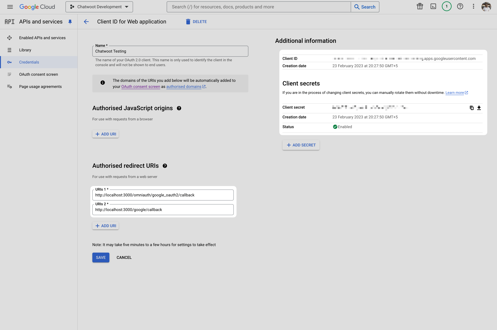
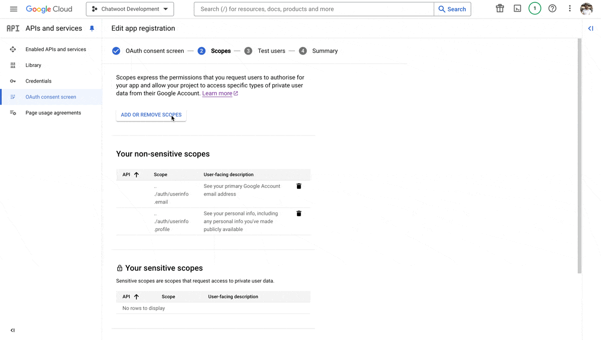
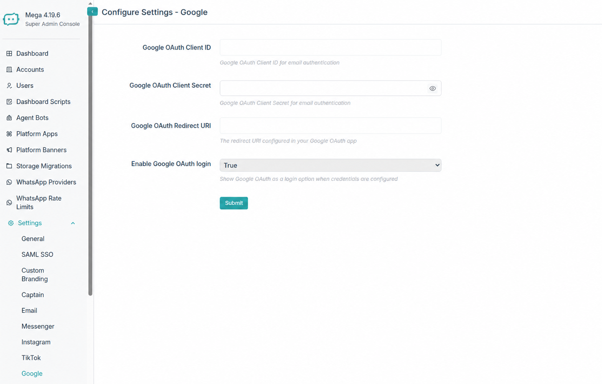
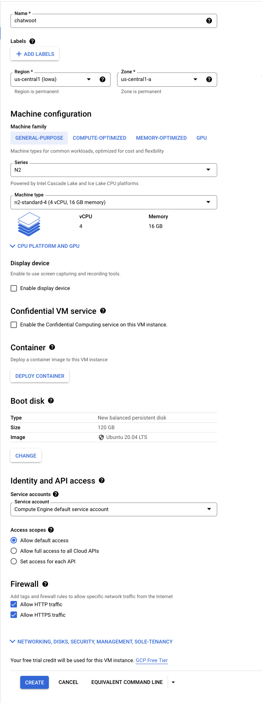
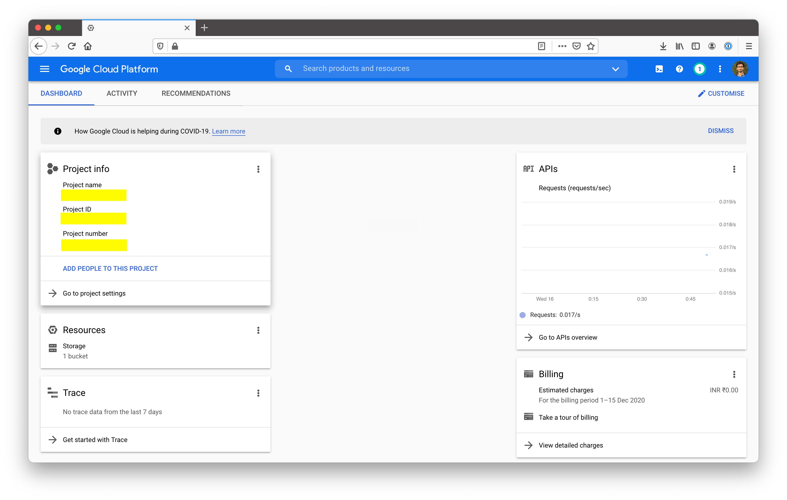
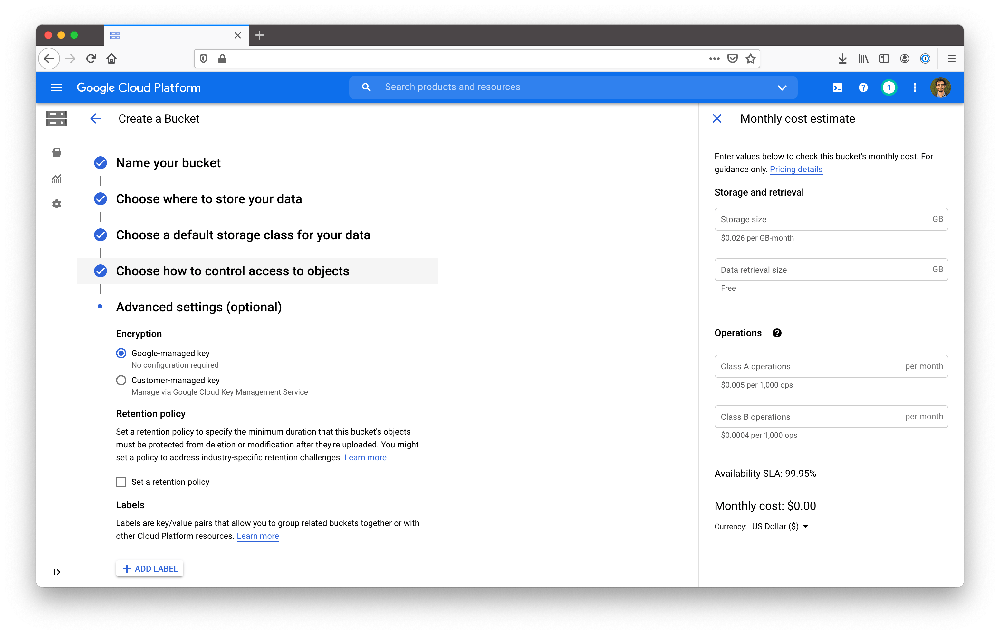
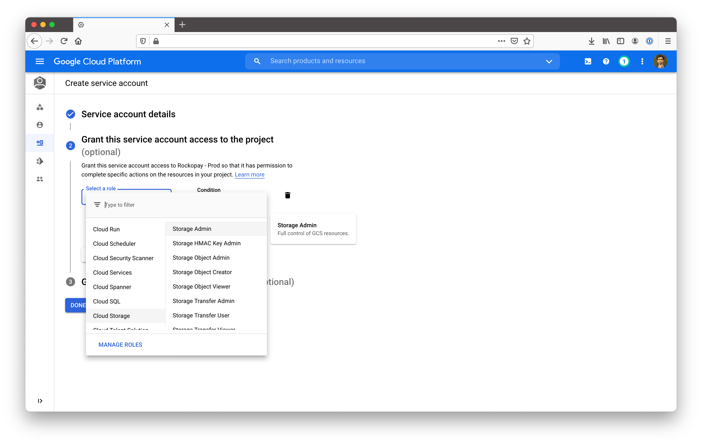
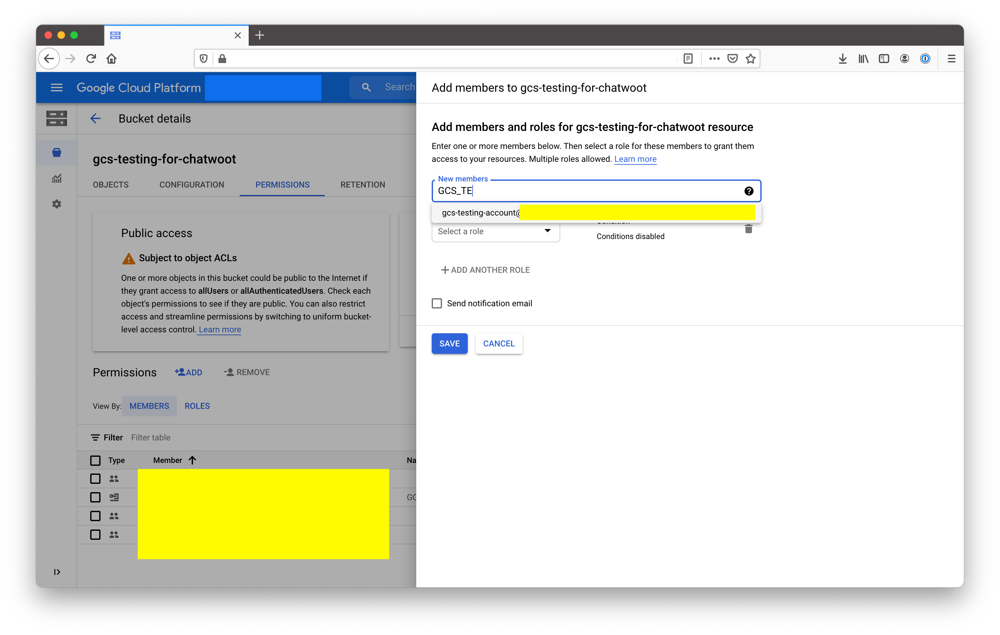
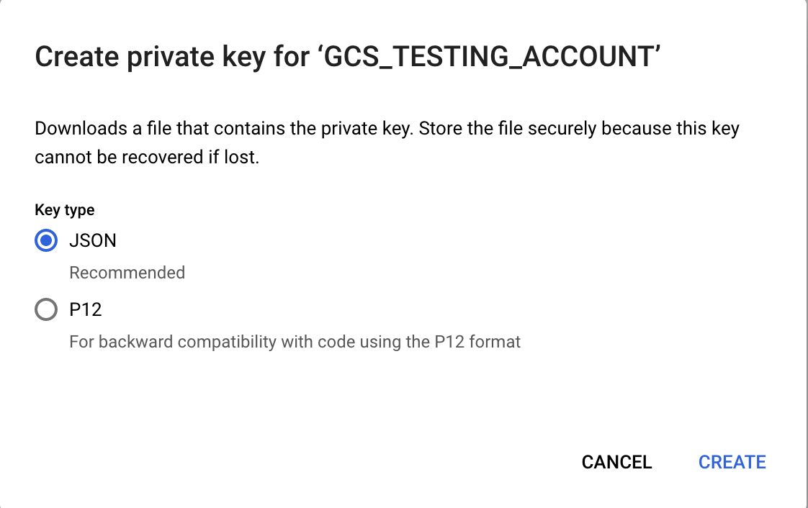

# MEGA auto-hospedado: integração com o Google

Documentação consolidada das opções Google no MEGA: Gmail/Google Workspace, login OAuth, implantação no Google Cloud Platform (GCP) e armazenamento no Google Cloud Storage (GCS).

## Google Workspace e Gmail com OAuth

Os aplicativos menos seguros do Google Workspace não são mais uma opção para esta integração. Para que o MEGA leia e gerencie e-mails do Gmail ou Google Workspace, crie um aplicativo OAuth no Google Cloud.

1. No [Google API Console](https://console.developers.google.com/), crie ou selecione o projeto e registre o aplicativo OAuth.
2. Para o aplicativo do canal de e-mail, adicione `https://<url-da-sua-instancia>/google/callback` como URL de redirecionamento autorizada.
3. Copie o ID e o segredo do cliente para o MEGA:

```bash
GOOGLE_OAUTH_CLIENT_ID=369777777777-xxxxxxxxxxxxxxxxxxxxxxxxxxxxxxxx.apps.googleusercontent.com
GOOGLE_OAUTH_CLIENT_SECRET=ABCDEF-GHijklmnoPqrstuvwX-yz1234567
```



Caso já exista um aplicativo para login OAuth do Google, reutilize-o adicionando esta URL de redirecionamento; não remova a anterior. Reinicie o MEGA após alterar as variáveis.

### Escopos OAuth necessários

Em **OAuth consent screen** > **Edit App**, adicione e salve:

- `https://mail.google.com/`: ler, enviar, excluir e gerenciar e-mails.
- `email`: visualizar o endereço de e-mail do usuário.
- `profile`: visualizar nome, foto e dados básicos do perfil.



Organizações com menos de 100 usuários podem manter o aplicativo em modo de teste. Para atender mais de 100 usuários ou vários clientes, publique-o. Como ele usa um escopo restrito, conclua o [processo de verificação do Google](https://support.google.com/cloud/answer/9110914), que pode levar alguns dias.

## Login com Google

O OAuth de login usa um callback diferente do canal Gmail. Configure as três variáveis e reinicie o MEGA:

```bash
GOOGLE_OAUTH_CLIENT_ID=369777777777-xxxxxxxxxxxxxxxxxxxxxxxxxxxxxxxx.apps.googleusercontent.com
GOOGLE_OAUTH_CLIENT_SECRET=ABCDEF-GHijklmnoPqrstuvwX-yz1234567
GOOGLE_OAUTH_CALLBACK_URL=https://<dominio-do-seu-servidor>/omniauth/google_oauth2/callback
```

O caminho `/omniauth/google_oauth2/callback` é fixo no MEGA e precisa coincidir exatamente com a URL autorizada no Google API Console.

## Google Calendar no MEGA

O MEGA usa as mesmas credenciais OAuth globais para o Google Calendar e, opcionalmente, para login com Google. Configure a credencial uma vez por instalação; depois, cada conta conecta seu próprio calendário em **Settings > Integrations > Google Calendar**.

### Configuração no Google Cloud

1. Em **APIs & Services > Library**, ative **Google Calendar API**.
2. Em **OAuth consent screen**, preencha os dados do aplicativo. Use **Internal** somente para usuários do mesmo Google Workspace; use **External** para contas Gmail ou Workspace de clientes. Enquanto o aplicativo estiver em teste, adicione os usuários de teste.
3. Adicione os escopos solicitados pelo MEGA:

```text
openid
email
profile
https://www.googleapis.com/auth/calendar
```

4. Em **APIs & Services > Credentials**, crie um cliente OAuth do tipo **Web application**.
5. Em *Authorized JavaScript origins*, adicione apenas a origem HTTPS, sem caminho nem `/` final: `https://<seu-dominio>`.
6. Em *Authorized redirect URIs*, adicione obrigatoriamente o callback do Calendar:

```text
https://<seu-dominio>/google_calendar/callback
```

Se também ativar login com Google, adicione:

```text
https://<seu-dominio>/omniauth/google_oauth2/callback
```

> Calendar e login usam URLs diferentes. No MEGA, a URL do Calendar é formada por `FRONTEND_URL` mais `/google_calendar/callback`; portanto, o domínio público em `FRONTEND_URL` deve coincidir exatamente com a origem e o callback autorizados.

### Carregar credenciais pelo Super Admin

Como super admin, abra:

```text
https://<seu-dominio>/super_admin/app_config?config=google
```



Preencha e salve os campos exibidos em **Configure Settings - Google**:

| Campo | Valor |
|---|---|
| Google OAuth Client ID | Client ID do Google Cloud |
| Google OAuth Client Secret | Client Secret do Google Cloud |
| Google OAuth Redirect URI | `https://<seu-dominio>/google_calendar/callback` |
| Enable Google OAuth login | `False` somente para Calendar; `True` para também permitir login com Google |

Ao inserir as credenciais no Super Admin, não é necessário salvar o Client ID nem o segredo em variáveis de ambiente. Mantenha `FRONTEND_URL=https://<seu-dominio>` no servidor. As variáveis de ambiente continuam sendo um fallback válido para implantações legadas.

### Conectar um calendário por conta

1. Na conta relevante, abra **Settings > Integrations > Google Calendar**.
2. Clique em **Connect**, escolha a conta Google e conceda as permissões solicitadas.
3. De volta ao MEGA, selecione ou confirme o calendário de destino e salve as configurações.
4. Ative a sincronização, escolha a direção (**MEGA → Google**, **Google → MEGA** ou **Bidirectional**) e os módulos necessários: Calendar, Kanban, Conversations e Reminders.

O cartão Google Calendar só fica disponível quando o recurso da conta está habilitado e existem Client ID e Client Secret globais. A conexão e os tokens são guardados por conta, não como um calendário compartilhado pela instalação inteira.

## Implantar o MEGA no GCP

Este guia usa uma VM do Compute Engine para o MEGA. Para uma implantação cloud-native, use charts Helm com Google Kubernetes Engine (GKE).

1. No GCP, abra **VM > Compute Engine** e crie uma instância.
2. Escolha a região adequada, pelo menos 4 vCPUs e 8 GB de RAM (N2 de uso geral).
3. Escolha Ubuntu 20.04 com disco de 120 GB.
4. Acesse por SSH e siga a instalação do MEGA em Linux VM.
5. Acesse `http://<ip-da-sua-instancia>:3000` ou `https://<seu-dominio>` após concluir a configuração do domínio.



Depois configure o domínio, o e-mail e as demais variáveis de ambiente da instalação Linux VM.

## Armazenar anexos no Google Cloud Storage

Ative o GCS como serviço de armazenamento:

```bash
ACTIVE_STORAGE_SERVICE='google'
```

### Projeto e bucket

1. Copie o ID do projeto no Google Cloud Console:

```bash
GCS_PROJECT=seu-id-de-projeto
```



2. Abra **Storage > Browser**, use **Create bucket** e mantenha as opções padrão quando forem adequadas ao seu ambiente.



3. Configure o nome obtido:

```bash
GCS_BUCKET=nome-do-seu-bucket
```

### Conta de serviço e credenciais

1. Abra **Identity & Services > Identity > Service Accounts**, crie uma conta de serviço e conceda **Cloud Storage > Storage Admin**.



2. Em **Storage > Browser > seu bucket > Permissions**, adicione a conta como membro com **Cloud Storage > Storage Admin**.



3. Na conta de serviço, escolha **Keys > Add Key** e selecione JSON.



Cole o JSON em uma única linha. No MEGA 2.17+, envolva o valor em aspas simples:

```bash
GCS_CREDENTIALS='{"type":"service_account","project_id":"","private_key_id":"","private_key":"","client_email":"","client_id":"","auth_uri":"","token_uri":"","auth_provider_x509_cert_url":"","client_x509_cert_url":""}'
```

### Upload direto

Normalmente, os anexos passam primeiro pelo servidor MEGA. Para enviá-los diretamente ao GCS, ative:

```bash
DIRECT_UPLOADS_ENABLED=true
```

Depois configure o [CORS do bucket](https://edgeguides.rubyonrails.org/active_storage_overview.html#cross-origin-resource-sharing-cors-configuration) para permitir uploads diretos.
