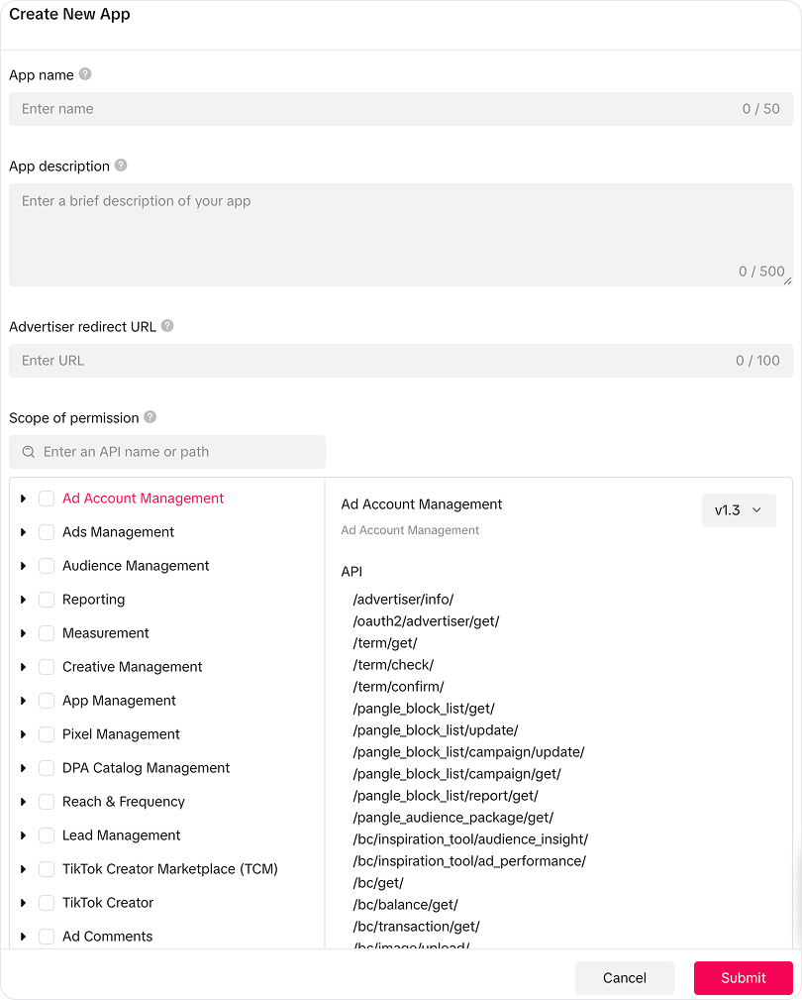
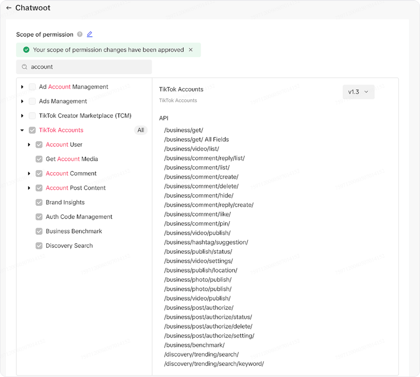

# Setting Up TikTok Channel in MEGA

Configure TikTok Business Messaging integration to manage TikTok conversations directly from MEGA.

The TikTok channel integration enables you to manage TikTok Business Messaging conversations directly from MEGA. Agents can receive and reply to messages from TikTok users, view shared posts, and handle image attachments — all within the MEGA dashboard.

Setting up the TikTok channel involves **7 main steps**.

## Prerequisites

Before you begin, make sure you have:

1. **Self-hosted MEGA instance** accessible via a public HTTPS URL
2. **TikTok Business Account** registered in an eligible region
3. **Direct message settings**: Your TikTok Business Account must be set to accept direct messages from everyone. Otherwise, you will need to manually accept messages in the TikTok app. [Learn how to update your message settings](https://ads.tiktok.com/help/article/how-to-update-your-tiktok-direct-message-permission-for-tiktok-messaging-ads?lang=en)
4. **TikTok Developer Account** at [developers.tiktok.com](https://developers.tiktok.com/)
5. **TikTok Business Messaging API Access** - [request special permissions](https://business-api.tiktok.com/portal/docs?id=1832183871604753) (requires manual approval)
6. **Super Admin access** to your MEGA instance

> **⚠️ Important Warning**  
> The TikTok Business Messaging API is region-restricted. It is **currently NOT available** for accounts registered in the European Economic Area (EEA), Switzerland, or the United Kingdom. Only TikTok Business Accounts are supported — personal accounts are not compatible.

## Step 1 — Create TikTok Developer Account

1. Go to [developers.tiktok.com](https://developers.tiktok.com/) and sign up
2. Verify your email address
3. Accept the Terms of Service

## Step 2 — Register Your Application



1. Go to [business-api.tiktok.com/portal/apps](https://business-api.tiktok.com/portal/apps) and create a new app
2. Fill in the required fields:
   - **App Name**: e.g., "Your Company - MEGA"
   - **App Description**: Brief description of your messaging use case
   - **App Icon**: Upload your company logo
   - **Terms of Service URL**: Your company's ToS URL
   - **Privacy Policy URL**: Your company's privacy policy URL
3. Once created, note down your **App ID** (client key) and **App Secret** (client secret)

## Step 3 — Apply for Business Messaging API Access

Access to the **TikTok Business Messaging API** requires manual approval. For detailed instructions, refer to the [official Business Messaging API access guide](https://business-api.tiktok.com/portal/docs?id=1832184145137922).

1. Open your app in the TikTok Developer Portal
2. Navigate to the Business Messaging API product
3. Submit an application with:
   - Your use case (e.g., customer support via MEGA)
   - How you will handle user data
   - Your organization details
4. Wait for TikTok's review and approval

> **📌 Note:** Approval typically takes a few days but can take longer for specialized access. You cannot proceed with the integration until your application is approved.

## Step 4 — Configure App Permissions and URLs

Once approved, configure the following in the TikTok Developer Portal:

### Required Permissions

After your app is approved, ensure the **TikTok Accounts** permission is enabled under **Scope of permission** in your app settings.



### Authorization Redirect URL

Set the authorization redirect URL to:

```text
https://<FRONTEND_URL>/tiktok/callback
```

Replace `<FRONTEND_URL>` with your MEGA installation URL.

## Step 5 — Configure MEGA

### Super Admin Configuration

1. Log in to your MEGA instance as a Super Admin
2. Navigate to the app configuration for TikTok
3. Enter your **TikTok App ID** and **TikTok App Secret**
4. Click Submit

**Alternatively**, you can set these as environment variables:

```bash
TIKTOK_APP_ID=your_tiktok_app_id
TIKTOK_APP_SECRET=your_tiktok_app_secret
TIKTOK_API_VERSION=v1.3
```

> **📌 Note:** The default TikTok API version is `v1.3`. Configure this if you want to use a different TikTok API version. Make sure it's prefixed with 'v'.

**Restart the MEGA server** after making changes.

### Enable TikTok Feature

1. In Super Admin, navigate to Accounts
2. Select the account where you want to enable TikTok
3. Under Features, enable the TikTok channel
4. Save the changes

> **📌 Note:** TikTok will only show up in the inbox channel options once you have configured the App ID and App Secret and enabled the feature for the account.

## Step 6 — Configure Webhook

Set up the TikTok webhook to receive incoming messages. Open a Rails console on your MEGA server:

```bash
bundle exec rails console
```

Run the following command to register the webhook callback URL:

```ruby
Tiktok::AuthClient.update_webhook_callback
```

This sets the webhook URL to `https://<FRONTEND_URL>/webhooks/tiktok`.

You can verify the webhook configuration by running:

```ruby
Tiktok::AuthClient.webhook_callback
```

> **⚠️ Warning:** The webhook must be configured after setting the TikTok App ID and App Secret in Super Admin. If you change your MEGA domain, you will need to run this command again.

## Step 7 — Connect MEGA with Your TikTok Account

1. Start the connection from MEGA (Settings → Inboxes → Add Inbox → TikTok)
2. You will be redirected to TikTok to authorize
3. Approve the requested permissions

After authorization:

- MEGA validates access
- TikTok channel is created or updated
- Associated inbox is enabled
- Incoming messages appear automatically in MEGA

## Troubleshooting

### TikTok channel not appearing in inbox options

- Verify the TikTok feature is enabled for the account in Super Admin
- Confirm `TIKTOK_APP_ID` and `TIKTOK_APP_SECRET` are set correctly
- Restart the MEGA server after configuration changes

### OAuth authorization fails

- Ensure the redirect URL in the TikTok Developer Portal exactly matches `https://<FRONTEND_URL>/tiktok/callback`
- Verify your TikTok app has all required scopes enabled
- Check that your TikTok app is approved for the Business Messaging API

### Not receiving incoming messages

- Verify the webhook is configured by running `Tiktok::AuthClient.webhook_callback` in Rails console
- Ensure the webhook URL is publicly accessible over HTTPS
- Check that your TikTok Business Account is in an eligible region
- Review Sidekiq logs for `Webhooks::TiktokEventsJob` errors

### Messages failing to send

- Check if the 48-hour reply window has expired
- Verify the access token is valid — MEGA automatically refreshes tokens, but if the refresh token expires (30 days), the channel will need reauthorization
- Ensure you are sending a supported message type (text only, or a single image)
- Check Sidekiq logs for `SendReplyJob` errors

### Channel shows "Reauthorization Required"

This happens when both the access token (around 24 hours) and refresh token (around 30 days) have expired, typically due to inactivity.

1. Go to Settings → Inboxes → select the TikTok inbox
2. Click Reauthorize
3. Complete the TikTok OAuth flow again

### Webhook signature verification fails

- Ensure `TIKTOK_APP_SECRET` matches the secret in your TikTok Developer Portal
- Check server clock synchronization — TikTok's signature verification requires timestamps within 5 seconds

## Limitations

- Business accounts only (personal accounts not supported)
- User-initiated messages only
- 48-hour reply window
- Supported message types: text, image, shared post
- Not available in EEA, Switzerland, or United Kingdom
- Access tokens expire (~24 hours, automatic renewal)
- Refresh tokens expire (~30 days, requires manual reauthorization)
