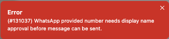

# Error de WhatsApp Business API: (#131037) Se Requiere Aprobación del Nombre para Mostrar

**Última actualización: 13 de enero de 2026**

Al intentar enviar mensajes a través de tu Cuenta de WhatsApp Business (WABA), puedes encontrarte con este mensaje de error:

> **(#131037) WhatsApp provided number needs display name approval before message can be sent**  
> **(#131037) El número proporcionado de WhatsApp necesita aprobación del nombre para mostrar antes de que se pueda enviar un mensaje**

Este problema ocurre cuando el **nombre para mostrar de tu número de teléfono aún no ha sido aprobado por Meta** (Plataforma de WhatsApp Business). Hasta que se complete esa aprobación, el número no se puede usar para enviar o recibir mensajes a través de tu BSP (Proveedor de Soluciones Empresariales como MEGA).

---

## 🔍 Por Qué Ocurre Este Error

Cada número de teléfono de WhatsApp Business debe tener un **nombre para mostrar aprobado** antes de que pueda ser activado.

Cuando registras un nuevo número bajo tu Cuenta de WhatsApp Business, Meta revisa el nombre para mostrar para asegurarse de que cumpla con las políticas de nomenclatura y negocios de WhatsApp.

Si tu nombre para mostrar todavía está **"En Revisión"** o ha sido **"Rechazado"**, el sistema bloqueará cualquier mensaje entrante o saliente, resultando en este error.

---

## ✅ Cómo Solucionar el Error

Sigue estos pasos para resolver el problema:

### 1. Ve a tu Meta Business Manager

- Inicia sesión en [https://business.facebook.com/](https://business.facebook.com/)
- Abre **Configuración Empresarial → Cuentas → Cuentas de WhatsApp**

### 2. Selecciona tu cuenta WABA y verifica la pestaña de Números de Teléfono

- Busca el número que muestra el error
- Verás el **Estado del Nombre para Mostrar** (por ejemplo, "Revisión Pendiente", "Aprobado" o "Rechazado")

### 3. Si el estado = Revisión Pendiente

- **Espera a que se complete la revisión de Meta**
- Este proceso generalmente toma hasta **24–48 horas**

### 4. Si el estado = Rechazado

- Haz clic en **Editar Nombre para Mostrar** y vuelve a enviarlo siguiendo las directrices de WhatsApp
- Evita usar nombres genéricos o engañosos. Debe representar claramente tu negocio o marca
- Puedes consultar la política de Meta aquí: [Directrices de Nombres para Mostrar de WhatsApp](https://www.facebook.com/business/help/757569725593362)

### 5. Una Vez Aprobado

- El error desaparecerá automáticamente
- Podrás enviar mensajes normalmente desde tu BSP (como MEGA)

---

## 💡 Consejo

Si recientemente migraste tu número a un nuevo BSP, la revisión del nombre para mostrar puede reiniciarse bajo el nuevo Business Manager. En ese caso, asegúrate de volver a verificar el estado de aprobación antes de intentar enviar mensajes.

---

## 🧾 Resumen

| Código de Error | Razón | Solución |
|-----------------|-------|----------|
| (#131037) El número de WhatsApp necesita aprobación del nombre para mostrar | El nombre para mostrar está pendiente o ha sido rechazado por Meta | Verifica el estado en Business Manager → Vuelve a enviar o espera la aprobación |

---

## Etiquetas

`#WhatsApp` `#Error131037` `#NombreParaMostrar` `#WABA` `#Meta` `#SoluciónDeProblemas`

---

## Recursos Relacionados

- [Directrices de Nombres para Mostrar de WhatsApp](https://www.facebook.com/business/help/757569725593362)
- [Meta Business Manager](https://business.facebook.com/)
- [Documentación de WhatsApp Business API](https://developers.facebook.com/docs/whatsapp)
- [Documentación de MEGA](https://github.com/megaapp977/stack)
