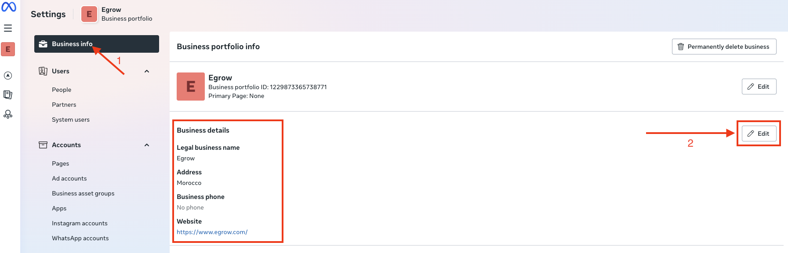
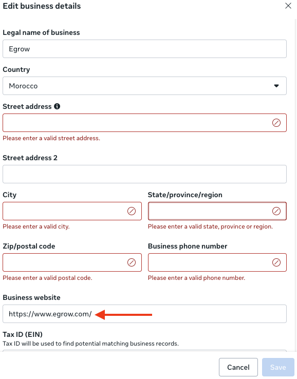
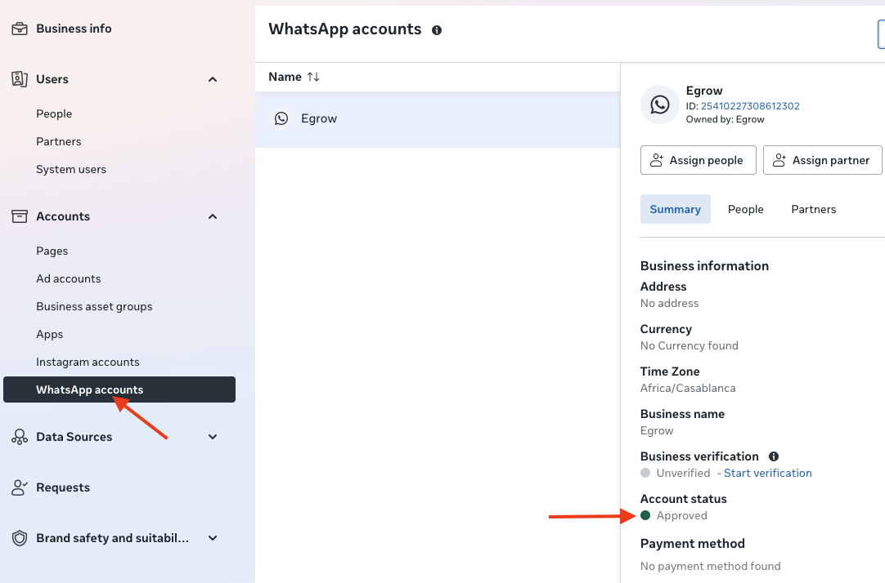

# Cómo Solucionar el Estado "Pendiente" en Tu Nueva WABA (Cuenta de WhatsApp Business)

**Última actualización: 13 de enero de 2026**

Si tu cuenta de WhatsApp Business (WABA) recién creada está atascada en estado **Pendiente**, no podrás vincular tu número a MEGA.

La razón más común de este problema es la **información incompleta del Portafolio de Negocios** dentro del Meta Business Manager, especialmente el **sitio web de la empresa**, que Meta utiliza para validar la identidad de tu negocio.

Este artículo explica cómo solucionarlo rápidamente.

---

## ¿Por Qué Tu WABA Muestra "Pendiente"?

Cuando creas una WABA, Meta verifica la información de tu negocio. Si los campos requeridos no están completos, especialmente tu **URL del sitio web**, Meta no puede verificar tu negocio y mantendrá la WABA en estado **Pendiente**.

Tu sitio web es una de las señales más fuertes que Meta utiliza para confirmar que tu negocio es legítimo.

---

## Cómo Solucionar el Estado "Pendiente"

Para resolver el problema, debes actualizar tu **Portafolio de Negocios** dentro de Meta Business Manager → Información Empresarial, **no dentro de MEGA**.

Sigue estos pasos:

### 1. Ve a Tu Portafolio de Negocios

Desde tu Meta Business Manager:

**Configuración Empresarial → Información Empresarial → Detalles del negocio**

### 2. Actualiza Todos los Detalles Empresariales Requeridos

Completa o actualiza:

- **Nombre del Negocio**
- **Nombre Legal** (si aplica)
- **Categoría del Negocio**
- **Descripción del Negocio**
- **Dirección del Negocio**
- **Número de Teléfono del Negocio**
- **Sitio Web del Negocio** (muy importante)

⚠️ **Meta utiliza tu sitio web como uno de los elementos clave para validar el negocio.**

Si no tienes un sitio web, puedes usar el enlace de tu página de Facebook o Instagram empresarial.

### 3. Guarda y Actualiza la Página del Administrador de WhatsApp

Después de actualizar la información:

1. **Guarda los cambios**
2. Ve a **Cuentas de WhatsApp → Resumen**
3. **Actualiza la página**
4. Espera unos momentos para que se actualice el estado

En la mayoría de los casos, el estado de WABA cambia de **Pendiente → Aprobado** en cuestión de minutos.

### 4. Si Sigue Pendiente, Vuelve a Crear la WABA

Si después de actualizar tu sitio web e información empresarial el estado no cambia:

1. **Elimina la WABA**
2. **Crea una nueva**
3. Meta validará la información empresarial actualizada inmediatamente

Esto resuelve casi todos los casos persistentes de estado Pendiente.

### 5. Contacta al Soporte de Meta (Opcional)

Si tu WABA sigue pendiente después de varias horas, contacta al Soporte Empresarial de Meta y menciona:

> **Nota**  
> "Mi WABA está atascada en estado Pendiente. He actualizado mi Portafolio de Negocios con un sitio web válido. Por favor, revísenlo."

---

## ¿Cuándo Puedes Vincular Tu Número a MEGA?

Una vez que tu WABA muestre como **Aprobada** dentro del Administrador de WhatsApp, puedes volver a MEGA y conectar tu número normalmente.

**Verifica el estado aquí:**

Meta Business Manager → Administrador de WhatsApp → Resumen

---

## ✅ Resumen

Para solucionar el estado Pendiente de WABA:

1. ✅ Actualiza la información de tu Portafolio de Negocios
2. ✅ Agrega un sitio web empresarial válido
3. ✅ Guarda y actualiza
4. ✅ Vuelve a crear la WABA si sigue atascada
5. ✅ Contacta al Soporte de Meta si es necesario

Una vez que la WABA esté **Activa**, puedes conectar tu número de WhatsApp con MEGA.

---

## Etiquetas

`#WhatsApp` `#WABA` `#Meta` `#CuentaEmpresarial` `#SoluciónDeProblemas`

---

## Recursos Relacionados

- [Meta Business Manager](https://business.facebook.com/)
- [Documentación de WhatsApp Business API](https://developers.facebook.com/docs/whatsapp)
- [Documentación de MEGA](https://github.com/megaapp977/stack)
